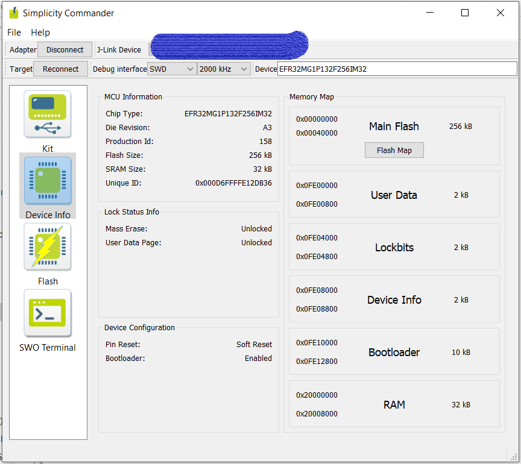

# JLINK-ARM-OB
   
Download GCY JLINK-ARM-OB-master.zip and UnZip it in your working folder.  
Install JLink Software fom the zipfile.  
Find JLinkARM.dll(W32) / JLink_x64.dll(W64) in your system and copy it to your working folder.  
Use [this](https://www.programmersought.com/article/93352322668/) guid for patching the firmware (BIN File from the Zip file) to the same version as the jlink software (DLL file).  

### Burning the bin file to your STM32F103:  
Use MINGW32 under windows for flashing your STM32F103.  
If needed installing missing python modules (pySerial, PyUSB).   
Use the python scripts from [BMP](https://github.com/blacksphere/blackmagic/tree/master/scripts).   
Move the BOOT0 jumper to 1 on STM32F103 then [connecting](https://medium.com/@paramaggarwal/converting-an-stm32f103-board-to-a-black-magic-probe-c013cf2cc38c) it with the serial adapter (VCC GND RX TX).  

In MINGW32:  ("J-Link-OB-XXXX.bin" = Your patched bin file)

``` 
$ scripts/bootprog.py  -d com9 J-Link-OB-XXXX.bin  
STM32 SystemMemory Production Programmer -- version 1.1  
Copyright (C) 2011  Black Sphere Technologies  
License GPLv3+: GNU GPL version 3 or later <http://gnu.org/licenses/gpl.html>  
  
Target bootloader version: 2.4  
  
Removing device protection...  
Erasing target device...  
Programming address 0x08015B00..0x08015BFA...  
Enabling device protection...  
All operations completed.  
```  
  
If having problem its normaly missing Py modules that writing errors, then install them, and wrong oder of RX and TX pins.  
  
Move the BOOT0 jumper to 0 on STM32F103 and disconnect all serial cables and plug in USB.  
You suld have one J-Link drive in your Device Manager under Universal Serial Buss controllers.  
  

Staring JLink.exe in one cmd.  
  
``` 
PS C:\> & 'C:\Program Files (x86)\SEGGER\JLink_V644f\JLink.exe' 
SEGGER J-Link Commander V6.44f (Compiled Apr 12 2019 17:17:37)  
DLL version V6.44f, compiled Apr 12 2019 17:17:02  
  
Connecting to J-Link via USB...O.K.  
Firmware: J-Link OB-STM32F103 V1 compiled Jan  7 2019 14:10:25  
Hardware version: V1.00  
S/N: 00000001-  
VTref=3.300V  
  
  
Type "connect" to establish a target connection, '?' for help  
J-Link>  
```  
 All are clean without any SN, just run "exec SetSN=xxxxxxxx" then "xxxxxxxx" its your serial number.  

Close JLink.exe and starting it agen and you have a SN.  


## Connecting your J-Link OB.  

Fom the J-Link OB manual:  
3.3 Target interface SWD  
If SWD (+ optional SWO) support is required on the target hardware to be designed, the following signals need to be connected:  
• SWCLK (PA5 / Pin 15)  
• SWDIO (PA7 / Pin 17)  
• SWO (PA10 / Pin 31)  
• #RESET (PA1 / Pin 11)  
If SWO support is not required (e.g. when the target CPU is Cortex-M0/M0+ based, which does not provide SWO support), the SWO signal can be left open.  
  
  
If having problem with connecting add one or more 100R in serie with SWCKL (5V host and 3.3V Target, the reference design have 100R on all SWD pins).    
  
Starting J-Flash.  
Create one new project with the rigth MCU.  
Target Connect.  
If all its OK you can manual read the internal flash and saving it. 
  
Install SimplicityCommande from Silabs homepage.  
Copy the JLinkARM.dll(W32) / JLink_x64.dll(W64) from your working folder to Simplicity Commander folder.  
Starting Simplicity Commander.  
  
[](E1743.jpg)
    
 
## WARNING !!
Its very easy bricking MGs with Simplicity Commander only then writing new bootloader!!  
 
 Dont let J-Link updating your probe. Its bricking it !!   
The trick its that having the same version in the J-Link probe and the J-Link.dll or J-Link want to updating the firmware. If letting J-Link updating the firmware you have a bricked probe. Then do a new firmware with the new JLinkARM.dll and flashing it on the STM32F103.     


