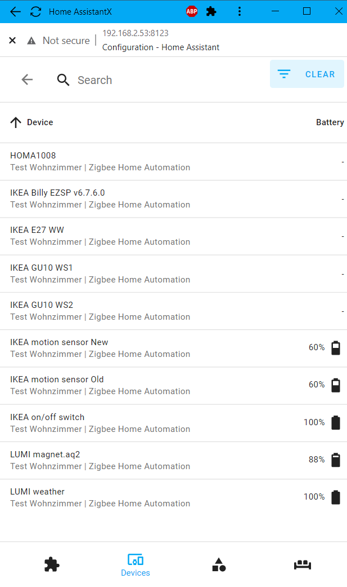

### Home Assistant
ICC-A-1 is up and running on HA with EZSP ver 6.6.4.0 and 6.7.6.0.  
Use 115200 as comport speed and if you like use [tasmoat as TCP UART](https://github.com/MattWestb/IKEA-TRADFRI-ICC-A-1-Module/tree/master/Tasmota).  
Funny thing is that HA in some viues is saying its a deCONZ coordinator (HA bug then some of my devices was in my deCONZ before).  
Current status its that its being problems with real Zigbee 3 devices its leaving the network (all ZB3 updated Ikea devices).  
   
  

The devs are rebuilding the bellows for supporting diferent command sets / protocoll versions for more flexibility and easyer maintaining the EZSP stacks.   
The current status is that the initial Zigbee 3 problems is fixes and real zigbee 3 devices is pairing in real zigbee 3 mode (updated TC-link key). Mutch testing and fintuning of the code is needed for getting in prodiction but the road is open and its looks very prommising !!

Its a huge work but in the end its being the rigth way to going for the project in the future.

### Large thanks to [Alexei](https://github.com/Adminiuga) ho have refactoring tones of code in zigpy / bellows for geting ZHA working.
