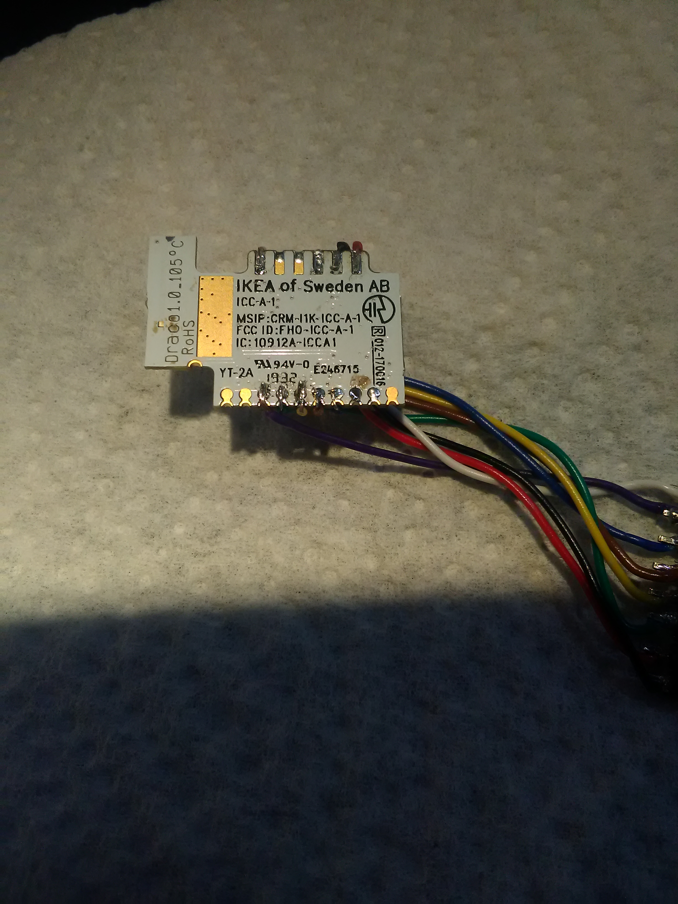
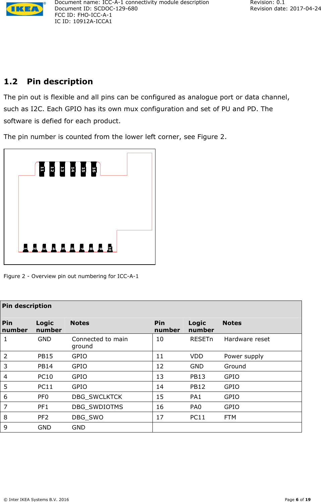

# ICC-A-1

Hocked up and dumped !!

### Module Pinout:

| Pad | EFR32 pins | Description |
|------------|-----------|-------|
| 01         | GND       | |
| 02         | PB15      | |
| 03         | PB14      | |
| 04         | PC10      | |
| 05         | PC11      | Present at 2 locations on PCB |
| 06         | PF0       | SWCLK |
| 07         | PF1       | SWDIO |
| 08         | PF2       | SWO   |
| 09         | PF3 / GND | ICC-1 / ICC-A-1 |
| 10         | RESETn    | Hardware reset | 
| 11         | VDD       | PAVDD, IOVDD, VREGVDD, VREGSW, VREGVSS | 
| 12         | GND       | | 
| 13         | PB13      | | 
| 14         | PB12      | | 
| 15         | PA1       | | 
| 16         | PA0       | Normaly LL buttom | 
| 17         | PC11      | Present at 2 locations on PCB | 

### Internal :

| EFR32 pins | Description |
|------------|-----------|
| PB11 | Flash CS |
| PD15 | Flash MOSI |
| PD14 | Flash MISO |
| PD13 | Flash SCLK |
| PF3 | Flash enable (on ICC-A-1 / Pin 09 on ICC-1) |

### Known module pins / pads use:

| Pad | EFR32 pins | Standard use | E1524 | E1743 |  ICTC-G-1 | E1603 |
|------------|-----------|-------|-------|-------|-------|-------|
| 01         | GND       | GND | GND |GND | GND |  |
| 02         | PB15      | RX | Left | RX |  |  |
| 03         | PB14      | TX | Down | TX |  |  |
| 04         | PC10      |  | On/Off | On/Up |  |  |
| 05         | PC11      |  | Right | LED |  |  |
| 06         | PF0       | SWD SWCLK |  |  | TP2 |  |
| 07         | PF1       | SWD SWDIO |  |  | TP1 |  |
| 08         | PF2       | SWD SWO |  |  | TP3 |  |
| 09         | PF3       |  |  |  | TP4 |  |
| 10         | RESETn    | HW Reset | Reset | Reset | Reset TP5 |  |
| 11         | VDD       |  3.3V | 3.3V | 3.3V | 3.3V | 3.3V |
| 12         | GND       | GND | GND | GND | GND | GND |
| 13         | PB13      | PMW 1 | LED |  |  |  |
| 14         | PB12      | PMW 2 |  | Off/Down |  | On/Off |
| 15         | PA1       | PMW 3 | Up |  | LLB TP6 | LED |
| 16         | PA0       | PMW 4 | LLB | LLB | LED TP7 | LLB |
| 17         | PC11      |  |  |  |  |

## FCC Pinout:
From [FCC ICC-A-1 RF module User Manual](https://fccid.io/FHO-ICC-A-1/Users-Manual/User-Manual-3432941)  

## More infos:
[MicroPython on ICC-1](https://trmm.net/ikea)  
[Hacking the IKEA TRÅDFRI](https://github.com/basilfx/TRADFRI-Hacking)  
[zw_TRADFRI-Hacking](https://github.com/zw/TRADFRI-Hacking/tree/master/hacks/L1527)  
